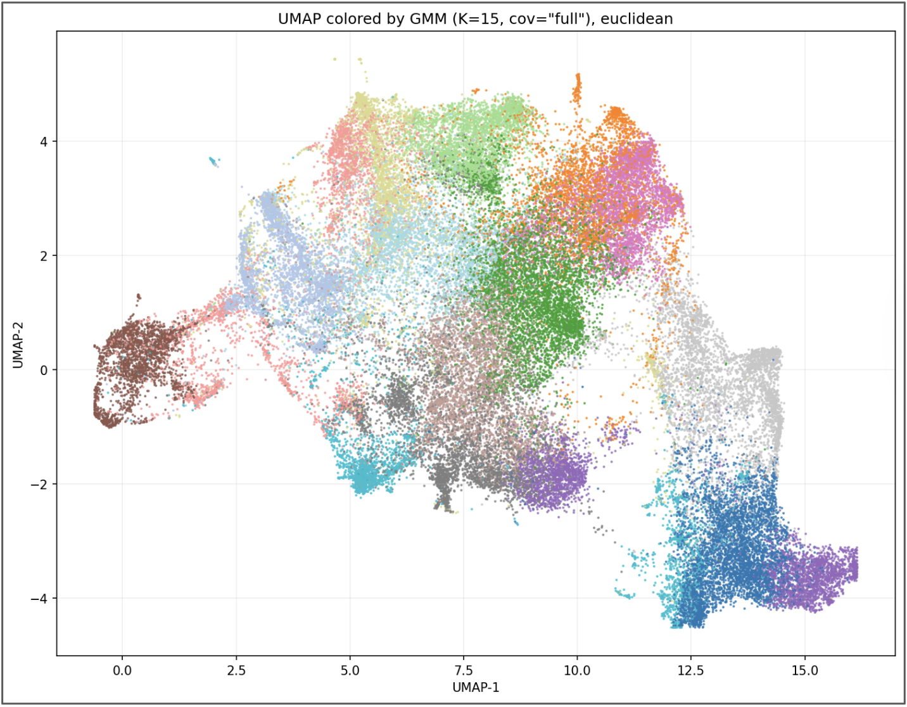
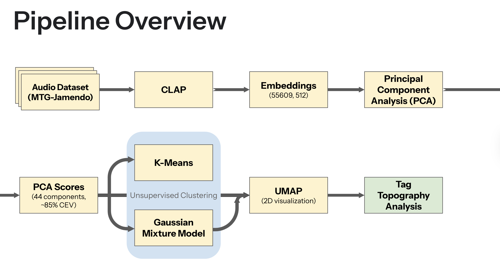
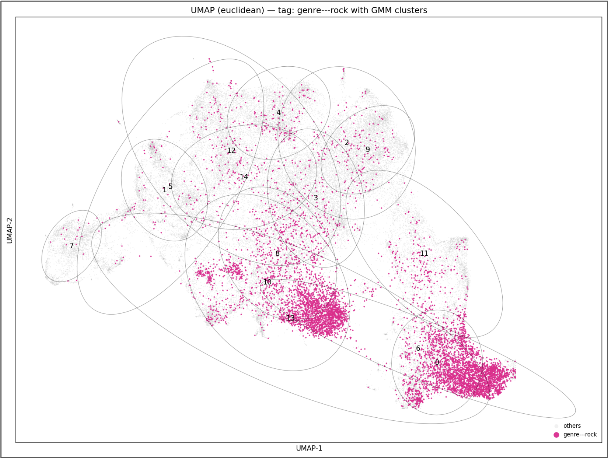
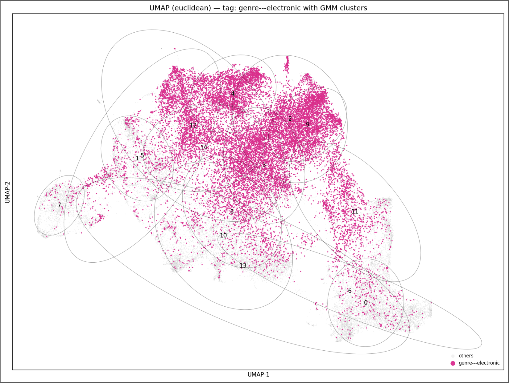
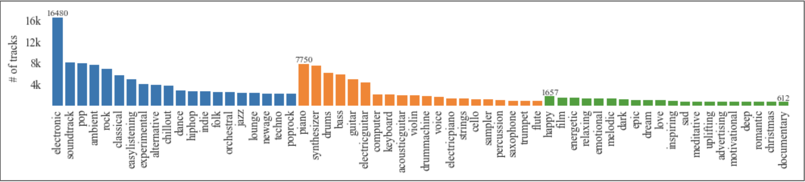
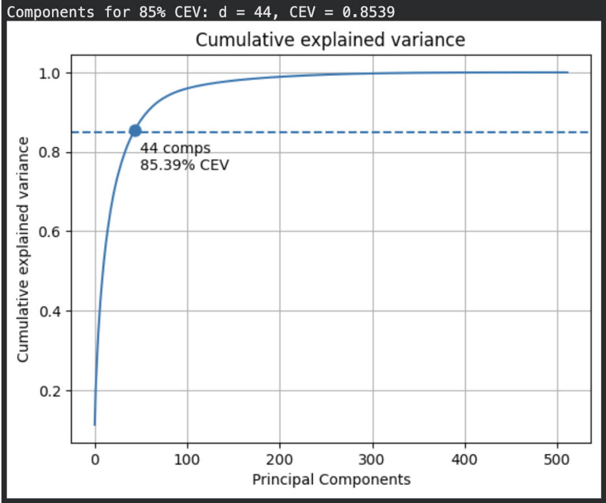
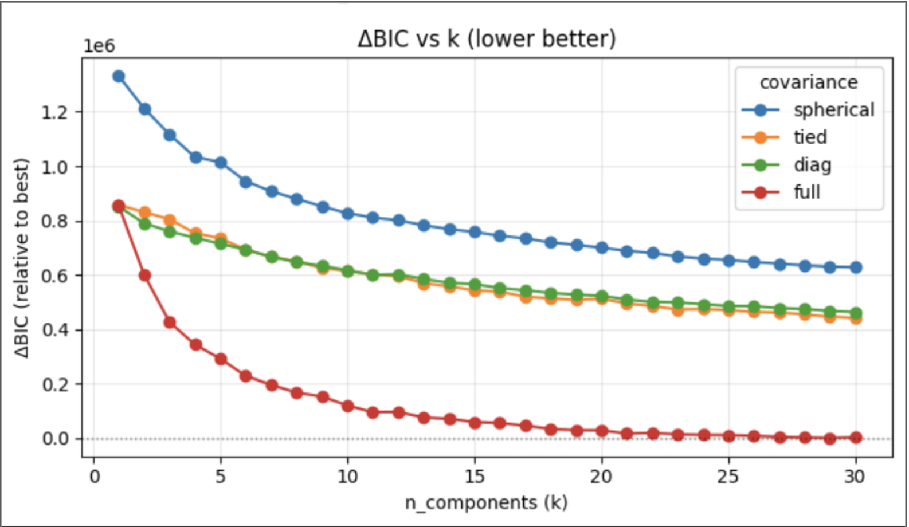

# Semantic Overlap in Music Tags  
### A CLAP Embedding Analysis of MTG-Jamendo

This repository contains the code, notebooks, and analysis artifacts for my Princeton University senior independent work project, **Semantic Overlap in Music Tags: A CLAP Embedding Analysis of MTG-Jamendo**.

<p align="center">
  
</p>

Music tags such as genre, instrument, and mood are central to music search, recommendation, playlist generation, and music information retrieval systems. However, many tags are acoustically ambiguous: a single label like `mood/theme-melodic` or `genre-psychedelic` can describe tracks that sound very different from one another. This project investigates whether music tags correspond to coherent regions in an audio embedding space, or whether they systematically spread across multiple acoustic modes — a phenomenon I refer to as **tag polysemy**.

Using the MTG-Jamendo dataset, I extracted 512-dimensional CLAP audio embeddings for approximately 55.6k tracks, reduced them with PCA to 44 dimensions while retaining 85.39% cumulative explained variance, and modeled the resulting embedding distribution with Gaussian Mixture Models. A full-covariance GMM with 15 components was selected for downstream interpretability, and UMAP was used to visualize the learned structure. I then quantified how dispersed each tag was across GMM components using entropy, normalized entropy, top-1 mass, and top-3 mass.

## Project Overview

The core research question is:

> Do music tags align with coherent regions in audio embedding space, or do they spread across multiple distinct acoustic modes?

The pipeline consists of:

1. Loading MTG-Jamendo metadata and audio files
2. Extracting CLAP audio embeddings
3. Normalizing embeddings and applying PCA
4. Comparing K-means and Gaussian Mixture Models
5. Selecting a full-covariance GMM for unsupervised structure discovery
6. Visualizing components with UMAP
7. Measuring tag dispersion across learned components
8. Ranking tags from localized/monosemous to dispersed/polysemous





The full project pipeline is described in the written report and implemented across several notebooks, including data processing, exploratory analysis, CLAP embedding extraction, K-means clustering, and GMM-based tag polysemy analysis.

## Main Findings

The analysis suggests that tag ambiguity is not simply random annotation noise. Instead, many tags show structured dispersion across audio embedding space.

Some tags are relatively localized, meaning they concentrate strongly in one or a few GMM components. Examples include:

- `genre-hardrock`
- `genre-rap`
- `genre-punkrock`
- `genre-singersongwriter`
- `genre-grunge`



Other tags are highly dispersed, spanning many or all components. Examples include:

- `mood/theme-melodic`
- `mood/theme-dream`
- `mood/theme-sad`
- `genre-psychedelic`
- `mood/theme-melancholic`



For example, `mood/theme-melodic` appeared across all 15 components with high normalized entropy and low top-1 mass, while `genre-hardrock` was much more concentrated in a dominant component.

## Methods

### Dataset

This project uses **MTG-Jamendo**, an open music dataset built from Creative Commons tracks on Jamendo. The dataset contains a fixed vocabulary of 195 tags spanning genre, instrument, and mood/theme categories. After filtering and joining metadata with embeddings, the final analysis used **55,609 tracks**.

<p align="center">
  
</p>

### Embeddings

Each track was represented using a 512-dimensional audio embedding from **CLAP**. Although CLAP is a multimodal audio-text model, this project uses only the audio encoder in order to test whether tag structure is visible in audio-derived representations alone.

### Dimensionality Reduction

Embeddings were L2-normalized and reduced with PCA to 44 dimensions, retaining 85.39% cumulative explained variance. This made downstream clustering and covariance modeling more stable and computationally tractable.

<p align="center">

</p>

### Clustering and Density Modeling

K-means was used as a baseline, but silhouette scores were low and cluster separation was weak. Gaussian Mixture Models provided a more flexible approach because they can represent ellipsoidal, overlapping components and assign soft membership probabilities. A sweep over component counts and covariance types showed that full-covariance GMMs fit the embedding distribution best.

<p align="center">

</p>

### Tag Polysemy Metrics

For each tag, I measured how its tracks were distributed across GMM components using:

- **Entropy**: how spread out the tag is across components
- **Normalized entropy**: entropy scaled by the number of components the tag appears in
- **Top-1 mass**: the fraction of tracks with that tag in its most common component
- **Top-3 mass**: the fraction of tracks with that tag in its three most common components

Tags with high entropy and low top-1 mass are interpreted as more polysemous; tags with low entropy and high top-1 mass are interpreted as more localized.

### Limitations 

The dispersion statistics were computed using hard component assignments, which discards uncertainty in the GMM responsibilities and can overstate separation for borderline tracks. The notion of “acoustic regions” is also model-dependent: the results may vary with the embedding model (CLAP checkpoint), the PCA dimensionality, and the selected K. Additionally, UMAP is used only for visualization and can distort global geometry, so visual “islands” should not be over-interpreted as true distances. Lastly, MTG-Jamendo reflects a particular distribution of open-license music and a fixed tag vocabulary, so tag meaning, generality, and co-occurrence patterns may differ in commercial music data or other cultural contexts.

## Repository Structure

```text
.
├── data.ipynb        # Dataset download / metadata handling
├── eda.ipynb         # Exploratory data analysis and tag statistics
├── clap.ipynb        # CLAP embedding extraction
├── kmeans.ipynb      # K-means baseline clustering and UMAP visualization
├── gmm.ipynb         # GMM model selection, UMAP plots, and tag polysemy analysis
├── figures/          # Generated plots and visualizations
├── results/          # Saved analysis outputs and tables
└── README.md
